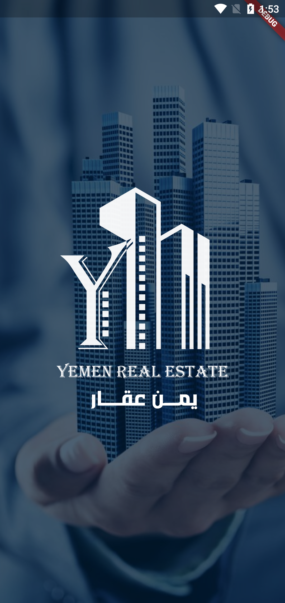
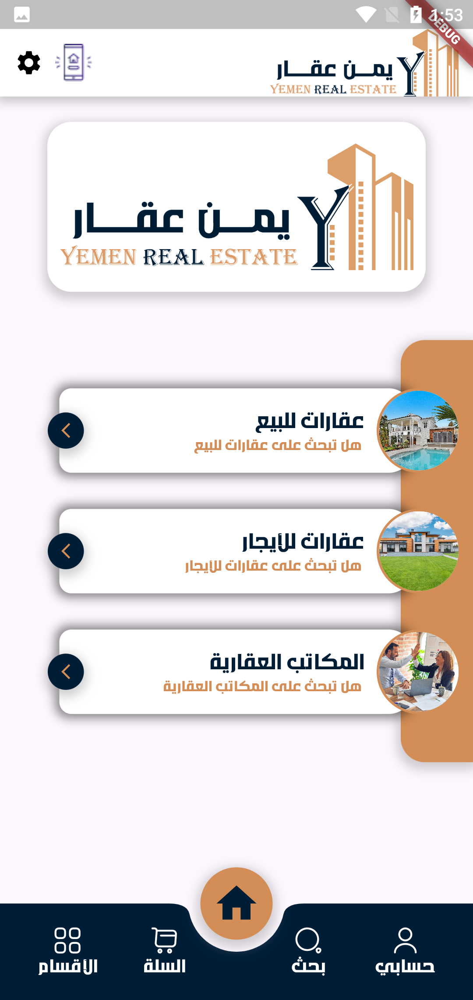
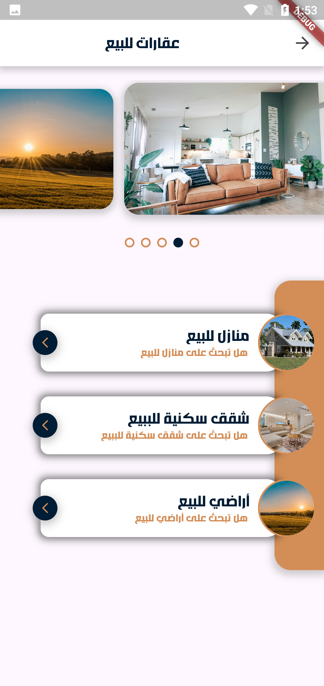
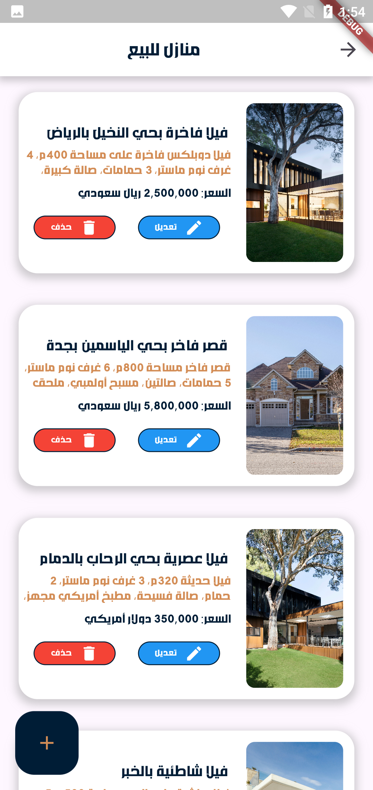
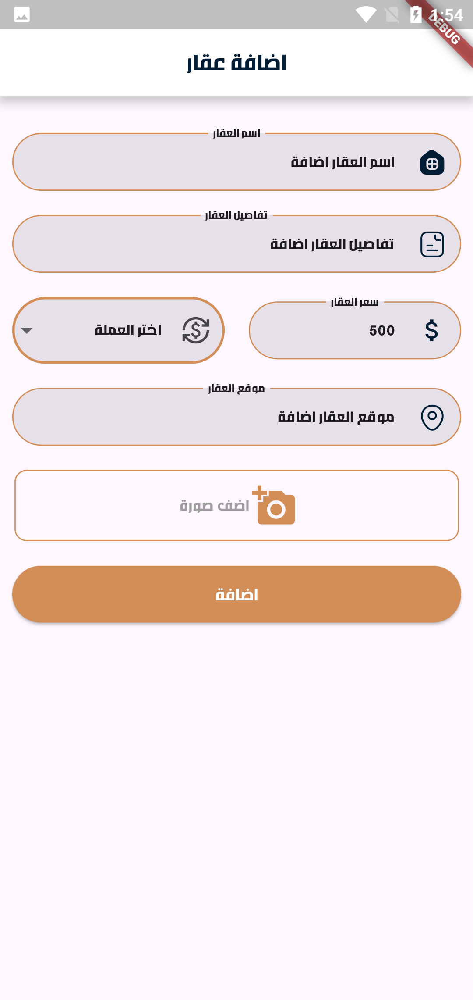
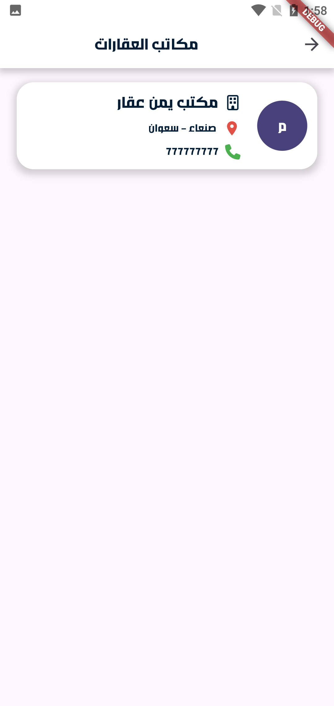
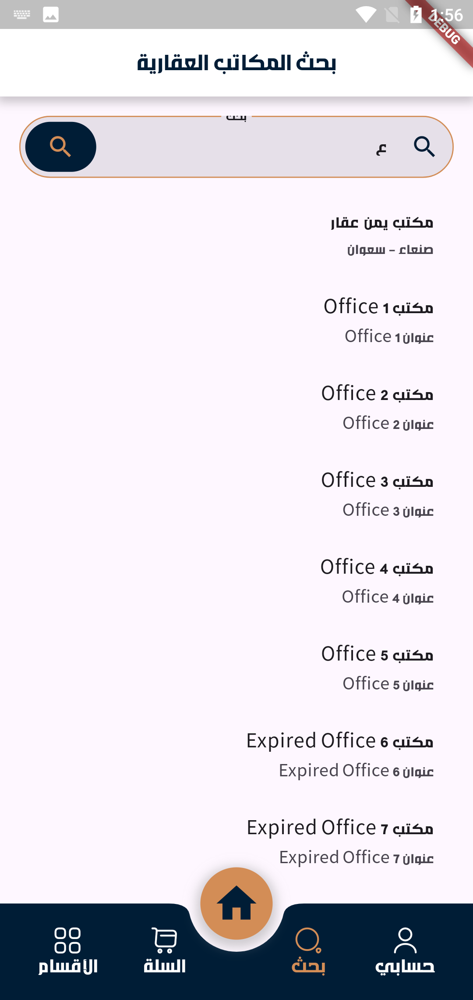
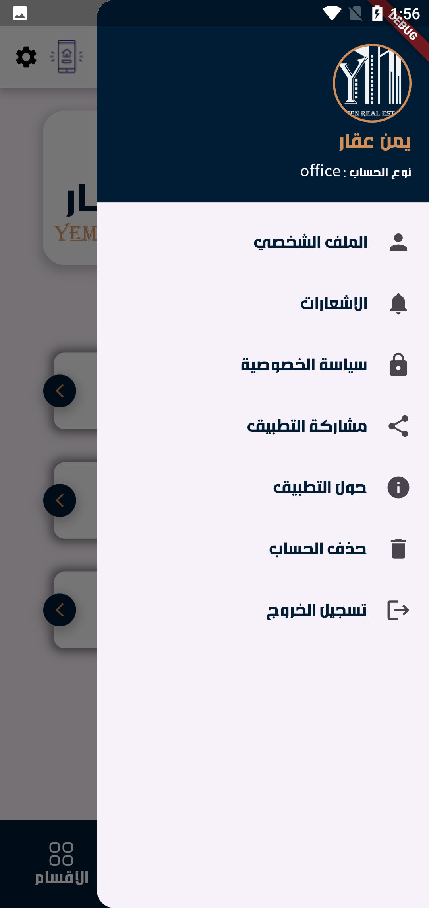
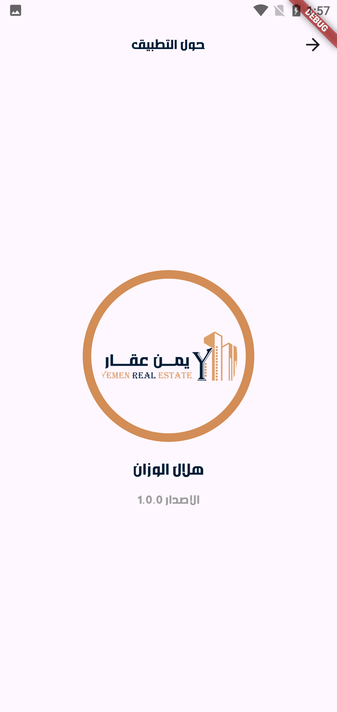

# 🏠 Yemen Aqar – Real Estate Mobile App

A comprehensive cross-platform real estate mobile application built with **Flutter** for Android  connected to a **Laravel RESTful API** backend with **MySQL** database. The app allows users to browse, search, and manage properties efficiently, while providing a secure admin dashboard for managing offices, properties, and users.

---

## 📌 Project Description

Yemen Aqar App allows users to browse and manage properties and real estate offices comprehensively. Features include secure authentication, subscription tracking, office verification by admin, advanced property search, and a responsive UI for smooth experience on both Android and iOS devices.

---

## ✨ Main Features

- **Authentication & Security:** Complete login system for offices and users with token-based authorization and biometric login.
- **Property Management:** Add, edit, and delete properties for approved offices.
- **Advanced Search:** Real-time filters, location-based queries, and Google Maps integration.
- **Navigation:** Easy access to My Account, Search, Cart, and All Sections.
- **Notifications:** Instant updates using Firebase Messaging.
- **Admin Dashboard:** Manage offices, properties, and users with comprehensive control.
- **Responsive UI:** Elegant interface across various screen sizes with custom Flutter widgets and animations.
- **Performance Optimization:** Efficient state management and optimized API responses for smooth experience.

---

## 🛠️ Technologies Used

- **Frontend:** Flutter, Dart  
- **Backend:** Laravel, PHP, RESTful API  
- **Database:** MySQL  

---

## 📷 Screenshots

